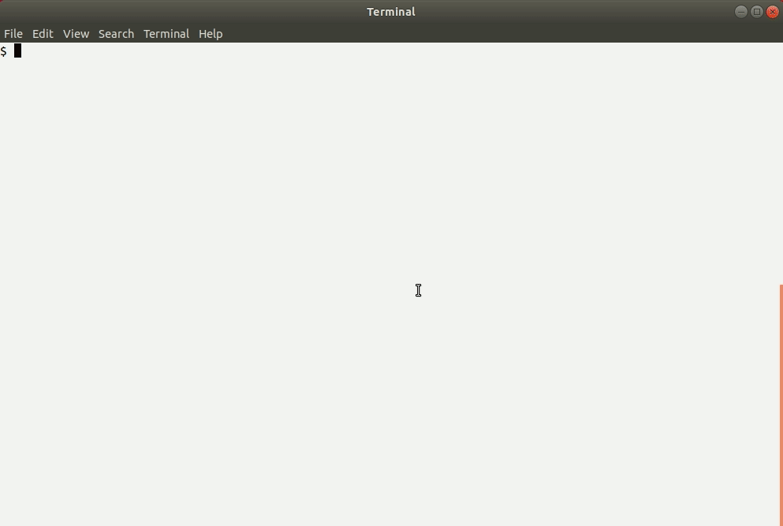

This is a navigation tool for what I call "stack trace flow". For a process that
has ran, it allows you to explore how the stack trace was changing
- which functions were calling which and in what order.

It allows you to open functions of interest in an external editor. It also
supports hiding from the view functions that are of little interest.

# Motivation

In my career I often had to quickly understand an unfamiliar complex codebase.
Many times I wished I had a tool like this to help me get a high-level idea of
where different pieces of the software fit into the picture.

# Demo

<details>
  <summary>Expand to view</summary>
  
</details>

# Usage

First, clone the repo and build with `cargo` as usual. Make sure you have
[ncurses installed in your system](https://github.com/gyscos/cursive/wiki/Install-ncurses).

```bash
$ git clone https://github.com/Baranowski/stacktraceflow.git
$ cd stacktraceflow
$ cargo build --release
```

Then download and unpack sample data generated for `rustc` while it was
compiling a small simple program (it's 37 MB when packed and 1.7 GB unpacked):

```bash
$ wget https://wojciech.net/rustc_stacktraceflow.tgz
$ tar -xzf rustc_stacktraceflow.tgz
```

Finally, run the tool:

```bash
$ target/release/stacktraceflow -f rustc_stacktraceflow/stacktraceflow.ThreadId\(2\).txt
```

Press `'?'` to see the built-in help, including keybindings.

## Editor integration

If you wish to be able to view the source code associated with each entry, you
need to supply the `-e` and `-d` options. The latter points to a directory
containing the source code of the program under analysis, in this case rustc.
For example:

```bash
$ target/release/stacktraceflow -f rustc_stacktraceflow/stacktraceflow.ThreadId\(2\).txt -e "gnome-terminal -- vim %F +%L" -d ../rustc
```

After that, you will be able to use the `'e'` key in the program which will open
selected item in the editor.

## Usage for other projects

In this early PoC, stack trace flows can be generated only for Rust programs
compiled with a modified version of `rustc`. Download the modified version of
compiler and build the first stage as usual:

```bash
$ cd ..
$ git clone https://github.com/Baranowski/rust.git -b stacktraceflow-v0.1
$ cd rust
$ cp config.toml.example config.toml
$ ./x.py build --stage 1 src/libstd
```

In order to be able to use this modified compiler for any of your projects,
`rustup` it:

```bash
$ rustup link stacktraceflow build/x86_64-unknown-linux-gnu/stage1
```

Finally, go to your project's directory and build it with this modified
compiler:

```bash
$ cd ../my_project
$ cargo +stacktraceflow build --release
```

Run your software as usual. After that, you will see some
`stacktraceflow.ThreadId(*).txt` files in the current directory. Those can be
opened with the `stacktraceflow` binary:

```bash
$ target/release/my_binary some args ...
$ $STACKTRACEFLOW_DIR/target/release/stacktraceflow -f stacktraceflow.ThreadId\(1\).txt -d ./ -e "gnome-terminal -- vim %F +%L"
```

# Features

* With the `-d` and `-e` options supplied, open source code of any function in
  an external editor.
* Remove uninteresting functions from the view either on their own (their
  children will assume their position in the tree) or with their entire
  subtrees.
* All those edits can be saved to a configuration file and automatically
  reapplied on subsequent runs.
* That's it. It's pretty basic.

# Future work

* Support non-Rust programs. Most likely by generating stack trace flow data
  using a new Valgrind tool. (Or a special dynamic analysis tool built from
  scratch.)
* Optimize the stack trace flow format. Possibly make it binary rather than
  text.
* Support more views. For example, reverse the tree and for each function
  display its callers rather than callees.
